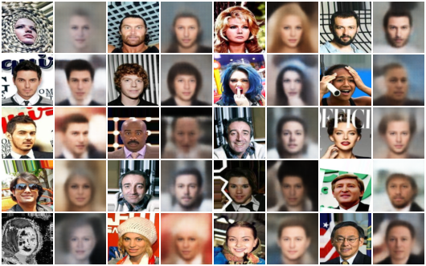

# VAE for Image Generation (CelebA)

This repository contains a PyTorch implementation of a Convolutional Variational Autoencoder (VAE) trained on the CelebA dataset. The project demonstrates a complete pipeline: data loading, model architecture design, stable training techniques, evaluation, and failure mode analysis.

## 📌 Project Goals
1.  **Reconstruction:** Accurately reconstruct input face images (64x64 RGB).
2.  **Generation:** Generate plausible new faces by sampling from the latent space.
3.  **Stability:** Implement techniques to ensure stable training dynamics.
4.  **Debugging:** Analyze failure modes and model limitations.

## 📂 Project Structure

```text
├── checkpoints/       # Saved model weights (best_vae.pth)
├── config/            # Configuration file (config.json)
├── data/              # Dataset directory
├── results/           # Generated artifacts (images, plots)
│   ├── failure_gallery/
│   ├── inference_test_set/
│   └── training_curves.png
├── src/               # Source code
│   ├── dataset.py     # Custom Dataset & DataLoader
│   ├── model.py       # VAE Architecture (Encoder/Decoder)
├── train.py           # Main training loop
├── evaluate.py        # Metrics calculation script
├── inference.py       # Generation & Morphing script
├── analyze_failures.py # Failure analysis script
├── plot_metrics.py    # Training visualization
└── requirements.txt   # Dependencies
```
## 🧠 Architecture & Design Choices

### 1. Model Structure (Convolutional VAE)
Instead of a simple linear MLP, I implemented a deep Convolutional VAE to preserve spatial hierarchies.

* **Encoder:**
    * 4 layers of `Conv2d` (Kernel 3, Stride 2, Padding 1) to downsample 64x64 $\to$ 2x2.
    * `LeakyReLU` activations for better gradient flow.
    * Flatten layer $\to$ two linear layers for $\mu$ (mean) and $\log\sigma^2$ (log-variance).
* **Latent Space:** 128 dimensions.
* **Decoder:**
    * Mirrors the encoder using `ConvTranspose2d` layers.
    * Upsamples 2x2 $\to$ 64x64.
* **Output Activation:** `Sigmoid` to constrain pixel values to $[0, 1]$.

### 2. Loss Function (ELBO)
The objective maximizes the Evidence Lower Bound (ELBO):

$$\mathcal{L} = \mathcal{L}_{Recon} + \beta \cdot \mathcal{L}_{KL}$$

* **Reconstruction Loss:** `MSESum`. Chosen over BCE because RGB pixel values are continuous, assuming a Gaussian likelihood.
* **KL Divergence:** Measures the distance between the learned latent distribution and the prior $\mathcal{N}(0, I)$.

### 3. Training Stability & Engineering (Requirements Met)
To satisfy the requirement for stable training and advanced configuration, I implemented two specific techniques:

1.  **Gradient Clipping (Implemented in `train.py`):**
    * Applied `torch.nn.utils.clip_grad_norm_(model.parameters(), max_norm=1.0)`.
    * **Reason:** Generative models often suffer from exploding gradients. Clipping ensures parameter updates remain bounded, preventing numerical instability.

2.  **$\beta$-VAE Parameterization (Configured in `config.json`):**
    * Set $\beta = 1.2$ (instead of standard 1.0).
    * **Reason:** A value of $\beta > 1$ encourages better disentanglement in the latent space, forcing the model to learn more meaningful features, albeit with a slight trade-off in reconstruction sharpness.

---

## 📊 Evaluation & Results

### Quantitative Metrics (Test Set - 15 Epochs)
* **Total Loss:** ~174.3
* **Reconstruction Loss (MSE):** ~114.4
* **KL Divergence:** ~59.9

### Training Curves
The model shows stable convergence without spikes, validating the Gradient Clipping strategy.


### Qualitative Results
* **Reconstruction:** The model captures facial structure, skin tone, and gender characteristics well.
* **Generation:** Random samples result in coherent face-like structures.
* **Morphing:** Interpolation between two latent vectors yields smooth transitions, proving the latent space is continuous and not just memorizing data.

*(See `results/inference_test_set/` for generated examples)*

---

## 🐞 Failure Analysis ("Failure Gallery")

I implemented a dedicated script `analyze_failures.py` to identify the "worst" reconstructions (highest MSE loss) on the test set.


*(Left: Original, Right: Reconstruction)*

### Diagnosed Issues:
1.  **High-Frequency Details:** The model struggles with detailed textures like hair strands or wrinkles. This is a known limitation of VAEs using MSE loss, which tends to output the "average" (blurry) prediction.
2.  **Accessories & Occlusions:** Images with dark sunglasses, hats, or hands covering the face have significantly higher loss. These are outliers in the distribution.
3.  **Complex Backgrounds:** Non-uniform backgrounds are often blurred out or replaced with a generic color.

## 🛠️ Environment Setup

You can run this project locally using a Python virtual environment.
**Prerequisites:** Python 3.9+ and CUDA (optional, but recommended for training).

### 1. Create a virtual environment

```bash
# Linux/MacOS
python3 -m venv venv
source venv/bin/activate

# Windows
python -m venv venv
.\venv\Scripts\activate
```
### 2. Install dependencies
```bash
pip install -r requirements.txt
```
