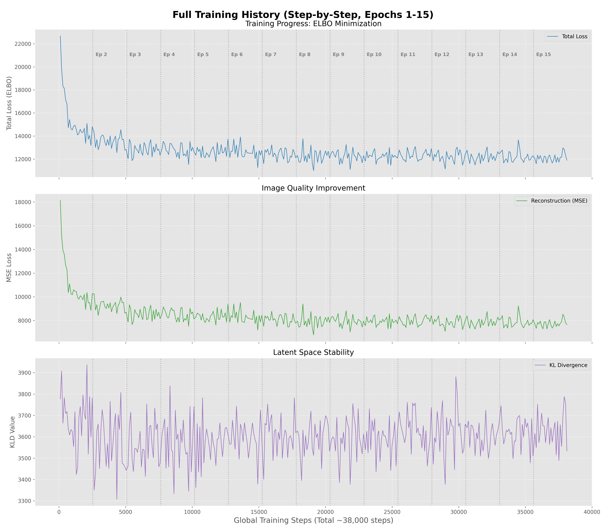

# Technical Report: Convolutional VAE for Image Generation (CelebA)

## 1. Project Overview
This project implements a **Convolutional Variational Autoencoder (Conv-VAE)** designed to reconstruct and generate human face images using the **CelebA dataset**. The implementation focuses on balancing the trade-off between reconstruction accuracy and latent space smoothness, ensuring a generative model that can produce plausible new samples.

## 2. Dataset & Preprocessing
* **Dataset**: CelebA (Large-scale Celeb Faces Attributes Dataset).
* **Preprocessing**: Images are cropped and resized to **64x64 pixels** with RGB channels.
* **Normalization**: Pixel values are scaled to the range $[0, 1]$ using `transforms.ToTensor()`.
* **Data Split**: The dataset is partitioned into training, validation, and test sets to monitor convergence and prevent overfitting (Train: 162,770 samples).

## 3. Architecture Design & Rationales
The model utilizes a symmetrical convolutional-deconvolutional structure to capture spatial hierarchies.

**Total Trainable Parameters:** ~1,184,256

### Encoder (Feature Extraction):
* **Structure**: 4 Convolutional layers with a stride of 2 ($64 \to 32 \to 16 \to 8 \to 4$).
* **Rationale**: Strided convolutions are used instead of pooling to maintain better gradient flow while reducing spatial dimensionality.
* **Channels**: Progresses from $3 \to 32 \to 64 \to 128 \to 256$. This increase in channels compensates for the loss of spatial resolution, allowing the model to encode complex facial features like eyes, hair, and skin tone.

### Latent Space ($z$):
* **Dimension**: **128**.
* **Rationale**: Unlike simpler datasets like MNIST, CelebA requires a larger latent space to represent high-dimensional RGB data and facial diversity. 128 dimensions provide a sufficient "bottleneck" to force compression while retaining enough information for clear reconstruction.

### Decoder (Image Synthesis):
* **Structure**: Mirrors the encoder using `ConvTranspose2d` layers to upsample the latent vector back to $64 \times 64 \times 3$.
* **Output Activation**: `Sigmoid` is applied to ensure the output pixels reside in the $[0, 1]$ range.

## 4. Loss Design & Stability Mechanisms
The model optimizes the **Evidence Lower Bound (ELBO)**:
$$\text{Loss} = \text{Reconstruction Loss (MSE)} + \beta \times \text{KL Divergence}$$

### Training Progress Visualization:
The graph below shows the convergence of loss functions (Total, MSE, and KLD), demonstrating the stability achieved through gradient clipping and $\beta$-regularization:

### Chosen Stability Methods:
* **$\beta$-VAE Strategy**: 
    * **Implementation**: A coefficient $\beta$ (defined in `config.json`) is applied to the KLD term.
    * **Justification**: A $\beta > 1$ strengthens the latent bottleneck, encouraging the model to learn disentangled representations. This ensures the latent space is continuous, which is vital for generating new images.
* **Gradient Clipping**: 
    * **Implementation**: `torch.nn.utils.clip_grad_norm_` with `max_norm=1.0`.
    * **Justification**: Prevents "exploding gradients" during the initial phases of training when KLD values can be volatile.
* **Batch Normalization**: 
    * **Implementation**: Integrated into both Encoder and Decoder (`nn.BatchNorm2d`).
    * **Justification**: Stabilizes internal activations, allowing for faster convergence and higher learning rates.

## 5. Failure Gallery & Qualitative Analysis
While the model achieves stable training, several typical VAE failure modes were identified:

* **Blurriness & Texture Loss**:
    * **Observation**: High-frequency details like wrinkles or hair strands are smoothed out.
    * **Diagnosis**: This is caused by the **MSE (Mean Squared Error)** loss, which averages pixel intensities, inherently leading to blurry edges in reconstructions.
* **Background & Accessory Failure**:
    * **Observation**: Complex backgrounds or hats are often replaced by solid colors or artifacts.
    * **Diagnosis**: With a latent dimension of 128, the model prioritizes the most statistically significant information (central facial features) over sparse background data.
* **"Average Face" Effect**:
    * **Observation**: Diverse individuals sometimes converge toward a generic "average" appearance.
    * **Diagnosis**: Over-regularization by the KLD term. If $\beta$ is too high, the model collapses the latent distribution toward the prior $\mathcal{N}(0, 1)$ at the expense of unique identity details.

## 6. Conclusion & Next Steps
The current implementation successfully demonstrates a stable, end-to-end convolutional VAE pipeline. To improve sharpness and generative diversity, the following steps are proposed:
* **Perceptual Loss**: Incorporating a VGG-based loss to penalize differences in feature space rather than raw pixel values.
* **KL-Annealing**: Gradually increasing $\beta$ from $0$ to the target value during the first epochs to prevent early posterior collapse.
* **Residual Connections**: Scaling the architecture with deeper residual blocks to handle higher-resolution (128x128) data.